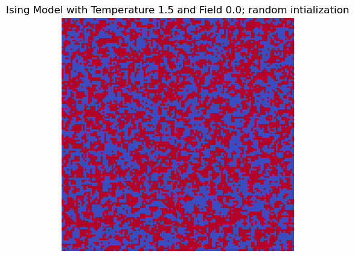
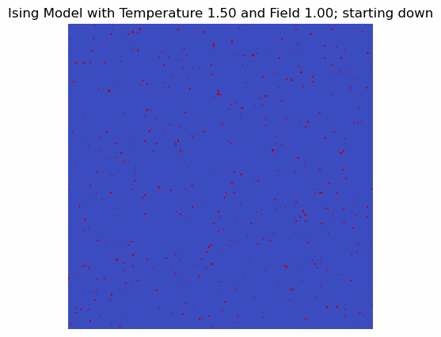
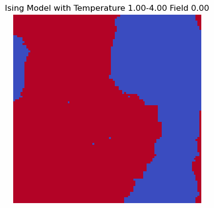
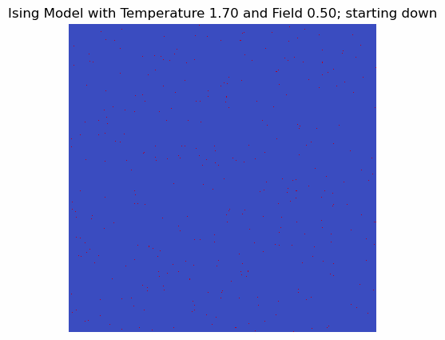

Ising Model
===========

## Description
Implementation of [Ising Model](https://en.wikipedia.org/wiki/Ising_model) using NumPy and Matplotlib. Used the Metroplis algorithm to update states. Can customize lattice size, lattice intial state, temperature, coupling constant, and external field.

Can generate .gifs of states over time and temperature.

## Dependencies
 - Python 3.x
 - NumPy
 - Matpotlib
 - Imageio

## Usage
1. Clone the repository:
    ```
    git clone https://github.com/SeaUrc/IsingModel.git
    ```

2. Install dependencies
    ```
    pip install numpy matplotlib imageio
    ```

3. Run the script
    ```
    python main.py
    ```

## Sample Generated GIFs

Over time with 1.0 temperature, 0 external field, random initialization

<p align="center">
    
</p>

Over time with 1.5 temperature, 1.0 external field, all down initialization

<p align="center">
    
</p>

Over temperature (1.0-4.0) with 0 external field, steady state

<p align="center">
    
</p>

Over time with 1.7 temperature, 0 external field, all down initialization

<p align="center">
    
</p>

